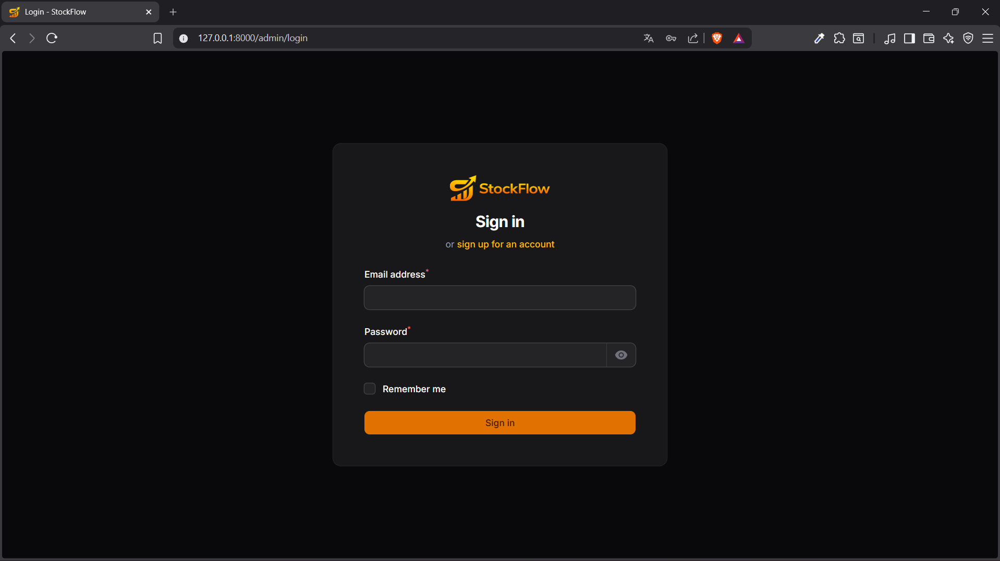
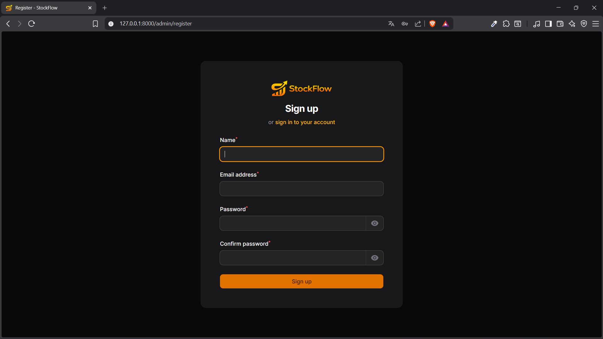
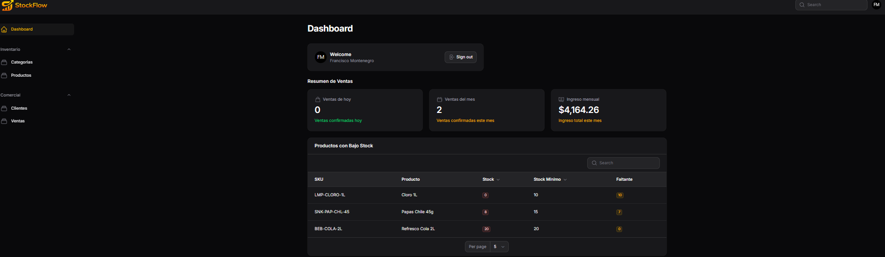
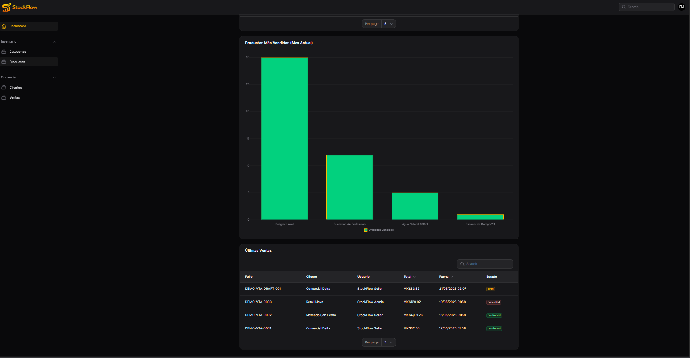
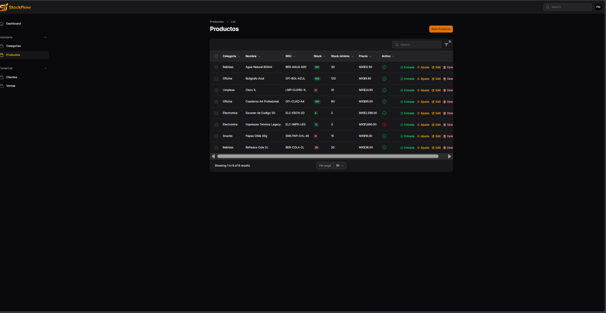
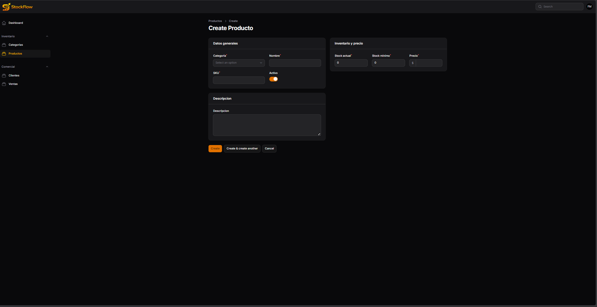
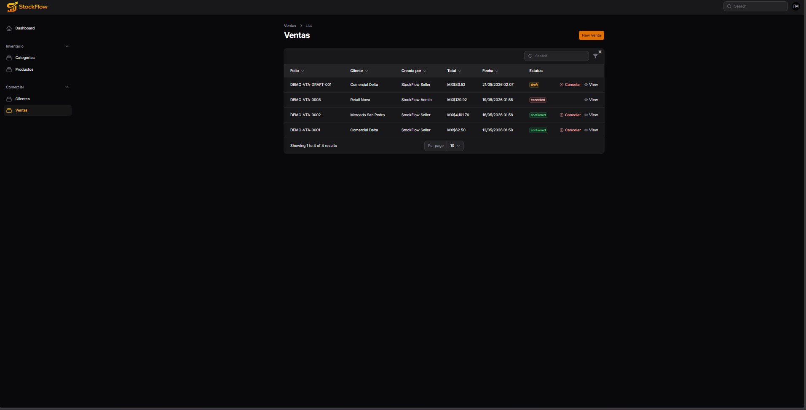
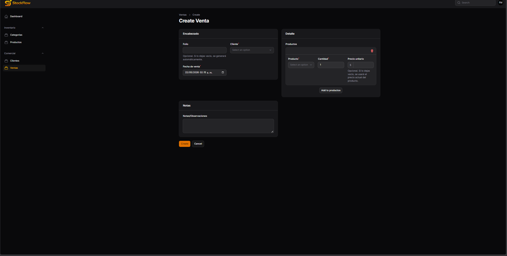
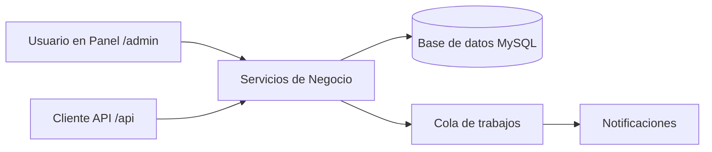

# Stock Flow


Sistema Web para la gestión de inventario y ventas con panel administrativo y API REST
autenticada por tokens.
StockFlow centraliza catálogo de productos, clientes, ventas, movimientos de inventario y
alertas de stock bajo.

---

## Descripción del proyecto

**StockFlow** está diseñado para negocios que necesitan controlar existencias, registrar
ventas con trazabilidad y visualizar métricas operativas en tiempo real.

Incluye:

- Panel administrativo `/admin` (Filament).
- API REST en `/api` para integraciones y clientes externos.
- Control de acceso por roles y permisos.
- Registro de movimientos de inventario.
- Flujo de ventas con validación de stock y cancelación.
- Alertas de bajo inventario (notificación en base de datos y correo opcional).

---

## Stack tecnológico

- **Backend:** PHP 8.2, Laravel 11
- **Panel admin:** Filament 5
- **Autenticación API:** Laravel Sanctum
- **Roles y permisos:** Spatie Laravel Permission
- **Base de datos:** MySQL (Recomendado)
- **Frontend build:** Vite 6, Tailwind, CSS 3, Axios, PostCSS
- **Colas / jobs:** Queue driver `database`
  -- **Testing:** PHPUnit 11

---

## Módulos Principales

1. **Categorías**
    - CRUD de categorías activas/inactivas.

2. **Productos**
    - CRUD de productos con SKU único.
    - Control de `stock`, `min_stock` y precio.
    - Entradas manuales y ajustes manuales de inventario.

3. **Clientes**
    - CRUD de clientes con código único.
    - Datos fiscales y límite de crédito.

4. **Ventas**
    - Registro de ventas con detalle por producto.
    - Validación de stock disponible.
    - Cálculo de subtotal, descuentos, impuestos y total.
    - Cancelación de ventas con reversa de inventario.

5. **Movimientos de inventario**
    - Historial de entradas/salidas/ajustes con trazabilidad.
    - Referencia polimórfica al origen del movimiento (ej. venta).

6. **Dashboard y resúmenes**
    - Ventas del día/mes.
    - Ingreso mensual.
    - Productos con bajo stock.
    - Top productos más vendidos.

7. **Seguridad y acceso**
    - Roles: `admin`, `seller`, `warehouse`.
    - Permisos granulares por módulo.
    - Acceso a panel condicionado por permiso `panel.access`.

---

## Instalación local

### 1) Requisitos

- PHP `>= 8.2`
- Composer
- Node.js `>=18` (recomendado 20+)
- npm
- MySQL 8+ (o compatible)

### 2) Clonar e instalar dependencias

```bash
git clone https://github.com/Isla1IA/StockFlow
cd StockFlow
composer install
npm install
```

### 3) Configurar entorno

```bash
cp .env.example .env
php artisan key:generate
```

Configura conexión a BD en .env y crea la base de datos (ejemplo: stockflow)

### 4) Migrar y seeders

```bash
php artisan migrate --seed
```

### 5) Levantar entorno de desarrollo

Opción recomendado (todo junto):

```bash
composer run dev
```

Esto inicia servidor Laravel, worker de colas, logs y Vite.

Opción Manual (por separado)

```bash
php artisan serve
php artisan queue:work
npm run dev
```

---

## Variables de entorno principales

Basadas en **.env.example** y configuración de config/stockflow.php.

| Variable                              | Propósito                            | Ejemplo           |
| ------------------------------------- | ------------------------------------ | ----------------- |
| APP_NAME                              | Nombre de la app                     | StockFlow         |
| APP_ENV                               | Entorno de ejecución                 | local             |
| APP_KEY                               | Clave de cifrado de Laravel          | base64:...        |
| APP_URL                               | URL base local                       | http://localhost  |
| DB_CONNECTION                         | Driver de base de datos              | mysql             |
| DB_HOST                               | Host de BD                           | 127.0.0.1         |
| DB_PORT                               | Puerto de BD                         | 3306              |
| DB_DATABASE                           | Nombre de BD                         | stockflow         |
| DB_USERNAME                           | Usuario de BD                        | root              |
| DB_PASSWORD                           | Password de BD                       | ``                |
| SESSION_DRIVER                        | Driver de sesión                     | database          |
| CACHE_STORE                           | Driver de caché                      | database          |
| QUEUE_CONNECTION                      | Driver de colas                      | database          |
| MAIL_MAILER                           | Canal de correo                      | log / smtp        |
| MAIL_HOST                             | Host SMTP                            | 127.0.0.1         |
| MAIL_PORT                             | Puerto SMTP                          | 2525              |
| MAIL_USERNAME                         | Usuario SMTP                         | null              |
| MAIL_PASSWORD                         | Password SMTP                        | null              |
| MAIL_FROM_ADDRESS                     | Remitente                            | hello@example.com |
| LOW_STOCK_ALERT_MAIL_ENABLED          | Activa correo en alertas de stock    | true              |
| LOW_STOCK_ALERT_MAIL_SUBJECT_PREFIX   | Prefijo de asunto de alerta          | [StockFlow]       |
| LOW_STOCK_ALERT_RECIPIENTS_PERMISSION | Permiso para destinatarios de alerta | products.view     |

---

## Credenciales de prueba (Si conviene)

Por seguridad, no se incluyen credenciales en el repositorio.

Opciones para entorno local:

1. Registrar usuario desde **/admin/register**
2. Asignar rol admin manualmente:

```bash
php artisan tinker --execute="App\Models\User::where('email','tu-correo@dominio.com')->first()?->assignRole('admin');"
```

**NOTA:** el seeder asigna **admin** al primer usuario existente al momento de ejecutar seeders

## Datos demo para pruebas (opcional)

Además del seeding base, este proyecto incluye un seeder opcional con datos de demostración para QA y pruebas funcionales:

- Catálogo de productos con distintos escenarios (stock saludable, stock bajo, agotado, inactivo, etc.).
- Ventas en distintos estados (confirmada simple, confirmada con impuestos/descuentos, cancelada y borrador).
- Usuarios/roles demo y clientes demo.

### Ejecutar solo seeders base

```bash
php artisan db:seed
```

### Ejecutar datos demo (opcional)

```bash
php artisan db:seed --class="Database\\Seeders\\DemoDataSeeder"
```

---

## Capturas

### Login y registro




### Dashboard Principal




### Listado de productos



### Entrada de Producto



### Ventas



### Creacion de venta



---

## Estructura general del sistema

```text
StockFlow/
├── app/
│   ├── Filament/
│   ├── Http/
│   │   ├── Controllers/Api/
│   │   ├── Requests/Api/
│   │   └── Resources/Api/
│   ├── Jobs/
│   ├── Models/
│   ├── Notifications/
│   ├── Policies/
│   └── Services/
├── config/
├── database/
│   ├── migrations/
│   └── seeders/
├── public/
├── resources/
├── routes/
└── tests/
```

---

## Flujo general (Alto Nivel)


